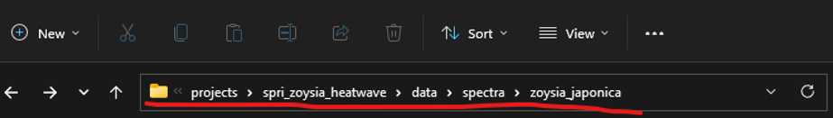

# SpectR
SpectR contains code to process and visualize spectral data.

## Before collecting spectra
Know what metadata you need to collect.

* The standard lab spectral metadata
  +	Check standard metadata structure on FulcrumApp. [Spectra_metadata_template](https://web.fulcrumapp.com/apps/4dc6bc6f-4f93-4487-84ee-c4cce5f2be0a) 
  + Check what variables and categories per variable you need to record.
  + Why are these variables and categories required?

* Create and customize your spectral metadata app
  + Set values to default if possible
  + Add variables specific to your project

Briefly narratively describe the methods you *will* use to collect the data in a google docs file.

* Add link to the google docs file in App description of Fulcrum.
* Change settings to "Anyone with link can view"
* Remember to include important details not apparent in your metadata, including the location of the plant that was sampled, supplies needed for sampling, how samples were handled (especially if collected/transported), etc.

## During Spectra Collection
*	Choose your own data collection adventure
* Discuss risks and advantages of each approach (written, excel, sheets, fulcrum phone, fulcrum laptop)
*	Fill metadata at the end of each data collection day
*	Append new metadata and new physiology to your Fulcrum spectra metadata and physiology apps.
*	Append narrative methods with daily-dated data collection notes
*	Download and store your spectra files by sampling event to OneDrive following the correct folder structure:
```
Projects\your_project_name\data\spectra\species_name\sampling_folders\
```


## After collecting spectra
If you don’t have a GitHub or haven’t used GitHub with R before, follow steps 4-14 at the [link](https://happygitwithr.com/) and you’ll be ready to start a new project as directed in the next steps!

* Open R studio and create a New Project. Choose Version Control and Git. 
* Copy the URL of the SpectR repository and browse folders to store it within the “codes” folder of your project folder. 
* Navigate to the code folder where SpectR was cloned through Rstudio. Then go to the code folder within SpectR and open the SpectR.R code by clicking on it.
* Download your spectra_metadata CSV file from Fulcrum and save it to the data folder of your project.
* Adjust the output filename, species, sampling, svc basename, and metadata file name in the first rows: 
```
#directory names
dir <- dirname(dirname(getwd()))
output_fn <- "zoysia_processed" #name of the output csv file

#folder names
spectra_fl <- 'spectra' #Root folder containing species folders
Species <- 'zoysia_japonica'#species folder containing sampling folders
Sampling <- '2022_07_10' #Sampling folder containing spectra files
svc_bn <- "Zoysia_2022710" #the basename under which the sig files are
meta_fn <-  paste0(dir,"/data/zoysia_spectra_meta.csv") #metadata filename

#settings
match <- c(990,1900) #sensor jumps
min_edge <- 400 #min wavelength to keep
max_edge <- 2400 #max wavelength to keep
res <- 1 #spectral resolution in nanometers
normalize <- FALSE #set to true if spectra should be normalized 
```

* Run the SpectR to process your spectra as desired. Think about how you need to process it!
  + Should I trim the spectra range? How much?
  + Should I resample my spectra? How much?
  + Should I match sensors?
  + Should I normalize my spectra?
  
## Merge your spectra with phys traits

Optional: Free space in your computer by asking Onedrive to remove local copies of SIG files.

* Download your physiology app from Fulcrum
*	Merge your physiology and spectra data using the physR code. You will need to adjust the file name of your physiology and processed spectra datasets in lines 4 and 5. 
```
phys.data <- read.csv(paste0(dir,'/data/zoysia_physiology.csv')) # point to phys data
processed.spectra <- read.csv(paste0(dir,'/data/spectra/zoysia_japonica/2022_07_10/zoysia_processed_2022_07_10.csv'))
```
*	Adjust the name of variables used for merging in lines 18-19.
```
#Merging
db <- merge( phys.data,processed.spectra,
       by.x = c( "plant_number", 'treatment', 'date','genotype'), 
       by.y = c( "plant_id", 'treatment', 'date','genotype'), 
       all = T) 
```
* Have fun analyzing!

